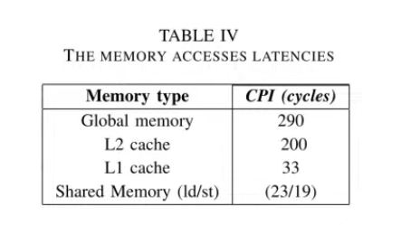

# GPUs

PyTorch

* Tensor computation (like NumPy) with strong GPU acceleration
* Deep neural networks built on a tape-based auto grad system&#x20;

Main ways to increase speed of models (in PyTorch):

1. Fuse more(?)
2. Use tensor cores
3. Reduce overhead
4. Quantize
5. Use a custom kernel&#x20;

dtypes (data types):

Define the kind of data that can be processed and stored. These data types determine how much memory is used and how the data is interpreted during computations&#x20;

* Integer Types
* Floating point types
* Boolean Type

Library-specific Data Types: NVIDIA CUDA, PyTorch, TensorFlow, NumPy

Considerations for choosing data types: memory usage, precision, performance, compatibility

T series.. A series... H series.. TPUs?

There are special formats for Ampere, Turning, and now Hopper GPUs. Hopper GPUs do not support Ampere or Turing formats. This means multiple CUDA kernels and the cuBLASLt integration need to be implemented to make 8-bit (LLMs) work on Hopper GPUs. [source](https://github.com/TimDettmers/bitsandbytes/issues/538)

**Pointwise operations (element-wise operations)**

operations that are applied independently to each element of a tensor (which can be a vector, matrix, or higher-dimensional array). This means the operation takes a single input value and produces a single output value without considering the neighbouring elements. Essentially, the function is applied to each element of the input tensor separately.

ReLU (Rectified Linear Unit), is defined as:

$$
ReLU(x_i) = max(0, x)
$$

For an input tensor X, the ReLU operation is applied to each element x\_i of X independently:

$$
\text{ReLU}(x_i) = 
\begin{cases} 
x_i & \text{if } x_i \geq 0 \\ 
0 & \text{if } x_i < 0 
\end{cases}
$$

Since each element is processed independently, pointwise operations like ReLU can be efficiently parallelized, which is beneficial for computation on GPUs.

**Examples of Pointwise Operations**

* Activation Functions: Besides ReLU, other activation functions like Sigmoid, Tanh, Leaky ReLU are also pointwise operations.
* Arithmetic Operations: Adding, subtracting, multiplying, or dividing a tensor by a scalar (or another tensor of the same shape).
* Thresholding Operations: Functions that set values above or below a certain threshold to a specific value (e.g., binary thresholding).

To perform this the CUDA kernel:&#x20;

assigns every element to a thread

Threads that are close hold elements that are close in memory (contiguous)

Each problem typically has a unique threading strategy

**Memory Hierarchy**

<figure><figcaption></figcaption></figure>

