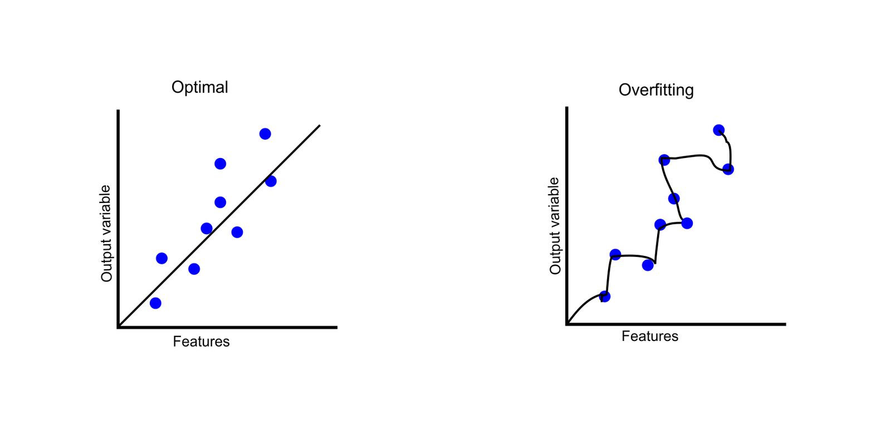

# ML Interview Questions

1. How is machine learning different from general programming?

Answer...

**Approach**:

* Traditional programming involves writing explicit step-by-step instructions to solve a problem.

<!---->

* Machine learning takes an automated approach where algorithms learn from data to build a model and make predictions, without being explicitly programmed for every scenario.

**Data Dependency**:

* Traditional programs rely on structured and static input data to produce an output.

<!---->

* Machine learning models can work with unstructured, dynamic data to identify patterns and make predictions.

**Flexibility and Adaptability**:

* Traditional programs are rigid and need to be manually updated if data or requirements change.

<!---->

* Machine learning models can adapt and improve their performance when new data is introduced, without needing code changes.

**Application Areas**:

* Traditional programming is suitable for well-defined, rule-based, and repetitive tasks like calculations, databases, websites, etc.

<!---->

* Machine learning excels at complex tasks requiring analysis, pattern recognition, and prediction like image recognition, natural language processing, recommendation systems, etc.

**Required Skillset**:

* Traditional programming requires expertise in coding languages, software principles, and frameworks.

<!---->

* Machine learning needs skills in statistics, algorithms, neural networks, and data manipulation using languages like Python and R.

Summary: Traditional programming follows a deterministic approach with manually coded rules, while machine learning leverages statistical algorithms to automatically build models from data, enabling more flexibility and adaptability for complex problems. The two approaches are complementary, with machine learning enhancing traditional software with intelligent capabilities. Good software skills are needed to develop scalable and maintainable production ML systems.

2. What is Overfitting in Machine Learning and how can it be avoided?

Answer...

Definition: Overfitting occurs when a model learns the training data too well, including its noise and outliers, which makes it perform poorly on unseen data.

### Causes of Overfitting

1. **Noise or Outliers in Training Data**: If the training data contains noise, errors, or outliers, the model may learn these patterns, leading to poor generalization. Examples include data entry errors, data aging, data transmission errors, and so on.

<!---->

2. **Insufficient Training Data**: With limited training examples, the model may struggle to capture the underlying patterns and instead memorize the training data.

<!---->

3. **High Model Complexity**: Models with high complexity, such as deep neural networks or decision trees with many levels, can overfit by learning intricate patterns specific to the training data.

Symptoms: High accuracy on the training data but low accuracy on validation or test data.

Prevention:

* Regularization: Applying techniques like L1 or L2 regularization to add penalty terms to the loss function, discouraging overly complex models.
* Early Stopping: Monitoring the validation error and stopping training when it starts to increase, preventing the model from fitting the noise in the training data.
* Data Augmentation: Increasing the diversity of the training data through techniques like cropping, rotating, or flipping images.
* Using Validation Sets: Splitting the data into training, validation, and test sets to better gauge how the model will perform on unseen data
* Pruning: Removing parts of the model (such as nodes in a decision tree) that provide little power in prediction.

Regularization, dropout, more data/augment data,&#x20;

3. Why do we perform normalization?

Answer...

4. What is the difference between precision and recall?

Answer...

5. What is the bias-variance tradeoff?
6. What is Principal Component Analysis?
7. What is one-shot learning?
8. What is the difference between stochastic gradient descent (SGD) and gradient descent (GD)?
9. What is the Central Limit theorem?
10. Explain the working principle of SVM.
11. What is the difference between L1 and L2 regularization? What is their significance?
12. What is the purpose of splitting a given dataset into training and validation data?
13. Why removing highly correlated features are considered a good practice?
14. Reverse a linked list in place.
15. What is the reason behind the curse of dimensionality?
16. What is Linear Discriminant Analysis?
17. Can you explain the differences between supervised, unsupervised, and reinforcement learning?
18. What are convolutional networks? Where can we use them?
19. What is cost function?
20. List different activation neurons or functions.
21. Explain Epoch vs. Batch vs. Iteration.
22. What is regularization, why do we use it, and give some examples of common methods?
23. Explain why the performance of XGBoost is better than that of SVM?
24. What is the difference between correlation and causality?
25. What is stemming?
26. What is Lemmatization?
27. What is Static Memory Allocation?
28. What are some tools used to discover outliers?
29. What are some methods to improve inference time?

[source](https://www.linkedin.com/posts/meri-bozulanova\_after-researching-the-most-common-questions-activity-7194734172802850816-5ulh?utm\_source=share\&utm\_medium=member\_ios)&#x20;
